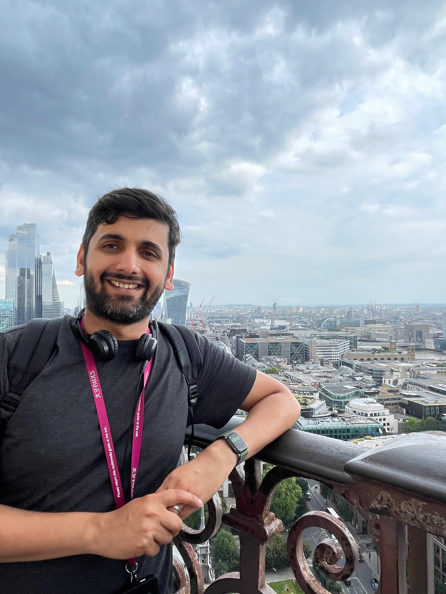

::: {.landing-grid}
::: {.landing-photo}

:::

::: {.landing-text}
# Hi, there! {.landing-name}

I am a community ecologist broadly interested in the maintenance of diversity, especially in response to environmental gradients. Currently, I am a [Research Fellow](https://farriorlab.github.io/people.html) at the [Department of Integrative Biology, University of Texas at Austin](https://integrativebio.utexas.edu). 

Earlier, I was a member of the HIFMB Postdoc Pool at the [Helmholtz Institute for Functional Marine Biodiversity (HIFMB)](https://hifmb.de), Oldenburg, Germany and an [Associate Junior Fellow](https://hanse-ias.de/en/the-institute/projects/postdoc-program) with the [Hanse-Wissenschaftskolleg Institute for Advanced Study](https://hanse-ias.de/en/), Delmenhorst, Germany. I completed my Ph.D. studying multi-species competition in natural communities at the [Program for Ecology, Evolutionary Biology and Behavior](https://eebb.natsci.msu.edu) and the [Department of Plant Biology, Michigan State University](https://plantbiology.natsci.msu.edu/).
:::
:::
