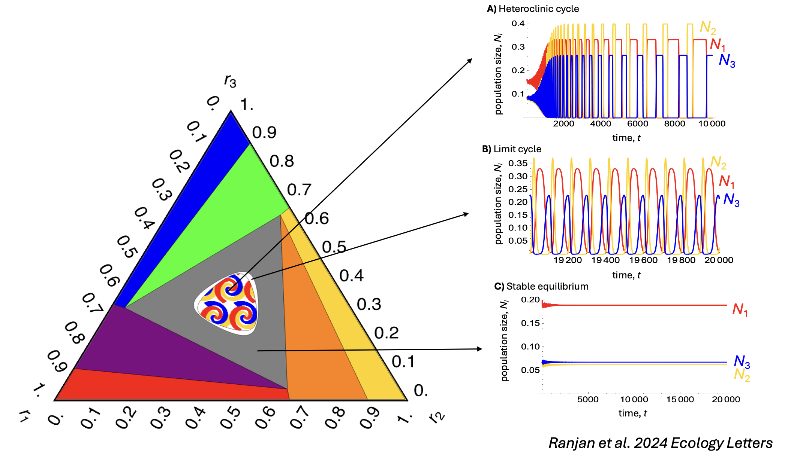
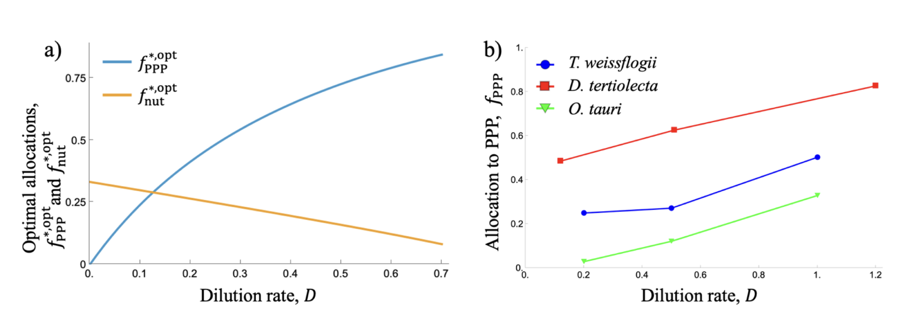
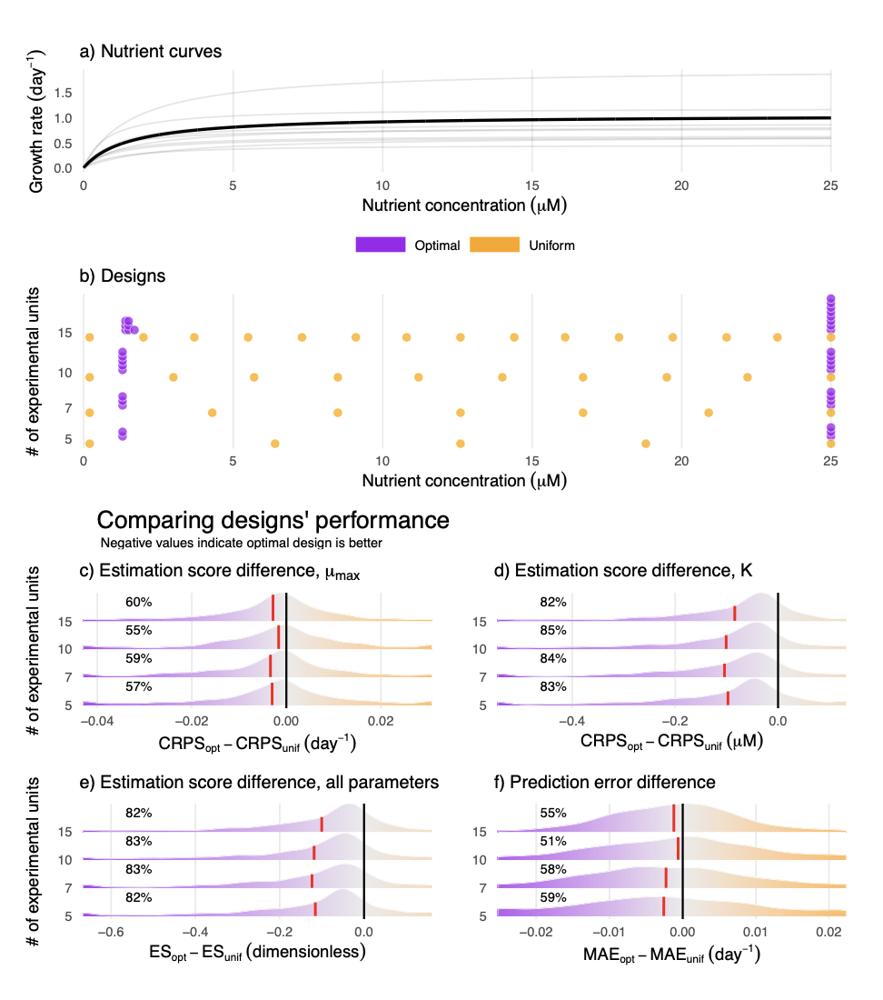

```{=html}
<style>
/* Page-scoped: only affects this Research page */
main.content p,
main.content li { font-size: 1rem; }

/* Polished figures */
main.content figure { margin: 1.4rem 0; text-align: center; }
main.content figure img {
  border: 1px solid #e3e6ea;
  border-radius: 8px;
  box-shadow: 0 1px 5px rgba(0,0,0,0.07);
}
main.content figure figcaption {
  font-size: 0.82rem;
  color: #6c757d;
  margin-top: 0.45rem;
  max-width: 90%;
  margin-left: auto;
  margin-right: auto;
}
</style>
```

My primary research goal is to understand and predict the outcome of eco-evolutionary processes maintaining our stunning natural diversity in a rapidly changing world. I work on primary producers such as phytoplankton and terrestrial plants, as they have outsized impacts on global carbon dynamics. I aim to understand how primary producer species coexist across environmental gradients and predict how they will change as climate change alters natural environmental gradients. I focus on key environmental drivers such as temperature, nutrient and light that have easily measurable physiological responses in primary producers and examine how these physiological responses scale up to determine species coexistence.

## Multi-species coexistence in natural communities

Interspecific competition is universal and structures natural communities across taxa. Our current understanding of competition comes from traditional ecological theory focusing primarily on mathematical models of species pairs. However, natural communities consist of tens to hundreds of species. I have addressed this knowledge gap by studying multi-species competition: 1) alongside evolution and the resulting trait patterns, 2) along nutrient gradients and grazers and 3) in three-species communities.

Collaborators: [Thomas Koffel](https://thomaskoffel.wordpress.com/), [Chris Klausmeier](https://www.kbs.msu.edu/kbs-people/faculty/christopher-klausmeier/)

Key papers: Ranjan and Klausmeier 2022, Ranjan et al. 2024, Ranjan and Bagchi 2016

{width="80%"}

## Impacts of multiple interactive environmental drivers on marine phytoplankton communities

Community-level responses to environmental change ultimately depend on how individual organisms respond to altered conditions. Further, environmental change is rarely through a single driver, even though it is usually studied that way. I am working on developing mechanistic, physiological models of phytoplankton that predict growth based on physiological processes including photosynthesis, respiration and nutrient uptake. Thus, these models scale up from physiological responses of phytoplankton to population growth rate and coexistence of species in a community.

Collaborators: [Alexey Ryabov](https://scholar.google.com/citations?user=Dd4l-QEAAAAJ&hl=en&authuser=1), [Helmut Hillebrand](https://hifmb.de/people/helmut-hillebrand/), [Mridul Thomas](https://www.mridulkthomas.com/), [Bernd Blasius](https://www.berndblasius.de), [Kim Halsey](https://microbiology.oregonstate.edu/directory/kimberly-h-halsey), [Miriam Seifert](https://www.awi.de/en/about-us/organisation/staff/single-view/miriam-seifert.html)

Key paper: Ranjan et al. 2026

{width="80%"}

## Forest dynamics

Terrestrial forests store about two-thirds of terrestrial biodiversity and half of terrestrial carbon, making them important in the global carbon cycle. However, forest dynamics in our Earth Systems Models can often be quite simplistic, often sacrificing realism for ease of use. A current challenge for forest dynamics models is to find the sweet spot between ecological realism and scalability. A promising avenue of research is the Perfect Plasticity Approximation (PPA) model which assumes that competition for light drives forest dynamics. The PPA model explains tree size distributions on a temperate forest and a tropical forest quite well. I am working towards generalizing this model across several other temperate and tropical forest sites to understand the key processes driving differences between temperate and tropical forests.

Collaborator: [Caroline Farrior](https://integrativebio.utexas.edu/directory/caroline-farrior)

## Optimal experimental design

Species growth rates always depend on multiple interacting environmental drivers. However, experiments with multiple drivers grow too unwieldy and are therefore rare. To solve this problem, I used Design Of Experiments (DOE) theory to optimize experimental designs to maximize information gained per measurement made. I showed that the resulting optimal designs are vastly superior to common designs such as ANOVA and marginally better than resource intensive designs like full factorials. I have also developed optimal designs for common single-factor experiments such as measuring growth against nutrients, light, temperature and toxins.

Collaborator: [Mridul Thomas](https://www.mridulkthomas.com/)

Key papers: Thomas and Ranjan 2024, Ranjan and Thomas 2026

{width="80%"}
